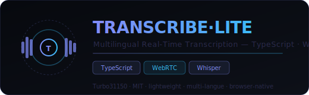

<div align="center">
  
  <br/><br/>

  [](LICENSE)
  [](#)
  [](#)
  [](#)
  [](#)

  <br/>
  <p><strong>Transcription multilingue temps réel · TypeScript · WebRTC · Whisper · Browser-native · 20+ langues</strong></p>
  <p><em>Version légère et standalone de la transcription multilingue — sans dépendances lourdes, fonctionne dans le navigateur</em></p>
</div>

---

## Présentation

**TRANSCRIBE·LITE** est la version légère de la transcription multilingue JARVIS. Contrairement à LUMEN·TRANSCRIBE qui nécessite le cluster complet, TRANSCRIBE·LITE fonctionne directement dans le navigateur via **WebRTC** et l'**API Web Speech**, avec un fallback Whisper backend optionnel.

---

## Architecture

```
Microphone (WebRTC getUserMedia)
        │
        ▼
  Web Speech API          Browser-native STT
  (en ligne)              Latence ~100ms
        │ ou
  Whisper Backend         Serveur optionnel
  (hors-ligne)            Précision maximale
        │
        ▼
  TypeScript Handler      Traitement texte
  └── Normalisation       Ponctuation auto
  └── Langue detect.      ISO 639-1
  └── Callback            onTranscript(text)
```

---

## Structure

```
transcription-multi-langue/
├── src/
│   ├── transcriber.ts      ← Core STT WebRTC
│   ├── whisper-client.ts   ← Backend optionnel
│   ├── language-detect.ts  ← Détection langue
│   └── ui/                 ← Composants React
├── public/
│   └── index.html          ← App standalone
├── package.json
└── tsconfig.json
```

---

## Installation

```bash
git clone https://github.com/Turbo31150/transcription-multi-langue.git
cd transcription-multi-langue
npm install
npm run dev     # :5173
# ou
npm run build && npx serve dist
```

---

## Usage

```typescript
import { Transcriber } from './src/transcriber';

const t = new Transcriber({ lang: 'auto', backend: 'webspeech' });
t.onTranscript = (text, lang) => console.log(`[${lang}] ${text}`);
await t.start();
```

---

<div align="center">

**Franc Delmas (Turbo31150)** · [github.com/Turbo31150](https://github.com/Turbo31150) · MIT License

</div>
